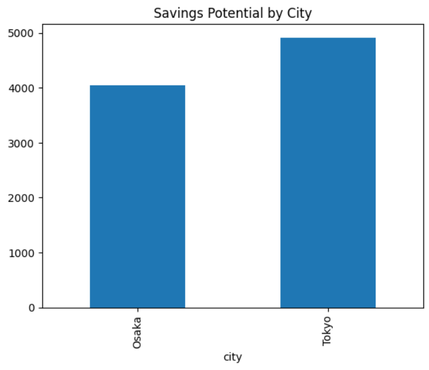
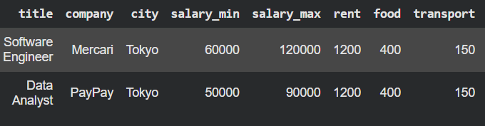

# japan-job-cost-analyzer
Python + SQL project analyzing salary vs cost of living in Japan

## Overview
This project analyzes software engineering and data roles in Japan and compares salaries against cost of living to estimate financial comfort across cities.

## Features
- Salary vs cost of living comparison
- Savings potential by city, company, and job title
- SQLite database integration
- Data analysis using Pandas
- Visualizations with Matplotlib
- Simple query tool for city comparison

## Tech Stack
- Python
- Pandas
- SQLite
- Matplotlib
- Google Colab

## Key Insights
- Cities vary significantly in savings potential
- Location impacts financial comfort more than salary alone
- Some job titles provide better lifestyle efficiency depending on city

## Example Use
Compare Tokyo vs Osaka for software engineering roles and estimate monthly savings.

## Future Improvements
- Integrate real job APIs or scraping (TokyoDev / Japan Dev)
- Convert into interactive dashboard (Streamlit)
- Add live cost-of-living data

## Sample Output

